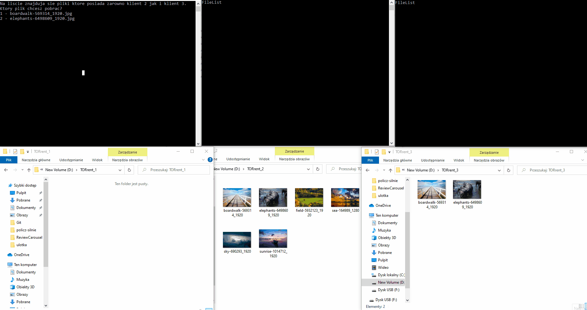

# Opis programu
Program został przygotowany jako projekt zaliczeniowy na studia. Pozwala on na przesyłanie plików przez sieć.
# Jak używać programu:
- W folderze jest 5 skryptów i każdy przedstawia jedną funkcjonalność programu.
- Każdy ze skryptów włącza najpierw klienta 2 i 3, a dopiero potem klienta 1 którym w każdym przypadku będzie użytkownik.
- Folder każdego klienta ma ścieżkę: D:\\TORrent_x (gdzie „x” to numer klienta).
- Klient 1 może samemu wybrać jaki plik go interesuje i z którym klientem chce współpracować.
# Zaimplementowane funkcjonalności:
- Wymiana list udostępnianych plików między hostami - skrypt "WyswietlanieListyPlikow".
- Pobieranie pliku od wybranego hosta - skrypt "Pobieranie"
- Wysyłanie pliku do wybranego hosta - skrypt "Wysylanie"
- Wznawianie przesyłania pliku w przypadku przerwania – skrypt "WznawianiePrzesylania"
- Ściąganie różnych części tego samego pliku z wielu hostów jednocześnie – skrypt "Pobieranie od wielu"

# Demo
### Pobieranie od wielu

# Komunikacja między klientami
### Komenda "FileInfo" - służy do pobierania od drugiego klienta informacji o jakimś pliku (suma kontrolna i wielkość).
Klient1 wysyła do klienta2 żądanie FileInfo a następnie nazwę pliku. Przykładowo:

- FileInfo
- zdjecie.jpg
- (pusty wiersz)

Jeśli klient2 posiada plik o takiej nazwie to wysyła odpowiedź:

- Ok
- 125151ffa (suma kontrolna)
- 124512 (rozmiar w bajtach)
- (pusty wiersz)

Jeśli klient 2 nie posiada takiego pliku to wysyła odpowiedź:

- No
- (pusty wiersz)

### Komenda "Download" - służy do pobrania pliku od klienta

- Download
- zdjecie.jpg (nazwa pliku)
- 0 (ile bajtów od początku pominąć przy pobieraniu)
- -1 (ile bajtów pliku ściągnąc zaczynając od punktu który określiliśmy w poprzednim wierszu. Wartość ujemna oznacza że ściągamy plik do końca a dodatnia, że ściągamy konkretną wartość np 10000 - ściągamy 10000 bajtów)
- (pusty wiersz)

Klient2 po otrzymaniu takiego komunikatu zaczyna wysyłać plik.

### Komenda "FileList" - służy do pobrania listy plików drugiego klienta

- FileList
- (pusty wiersz)

Jeśli klient2 ma jakieś pliki w folderze wysyła komunikaty:

- zdjecie.jpg
- zdjecie2.jpg
- (pusty wiersz)

Jeśli klient2 nie ma żadnych plików to wysyła:
- NoFiles
- (pusty wiersz)

### Komenda "Upload" - służy do wysyłania pliku do drugiego klienta

- Upload
- zdjecie.jpg (nazwa pliku)
- 215121312 (rozmiar w bajtach)
- 125151ffa (suma kontrolna)
- (pusty wiersz)

W odpowiedzi od klienta2 dostaje adres na jaki ma wysylac plik:

- localhost (adres)
- 20000 (numer portu)
- (pusty wiersz)

Klient1 po otrzymaniu komunikatu zaczyna wysyłać plik pod wskazany adres.

